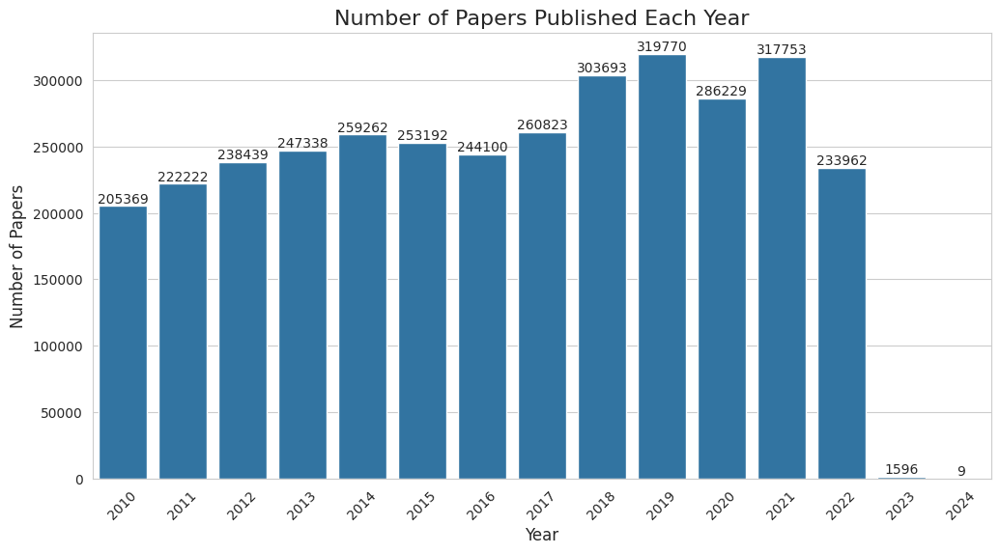
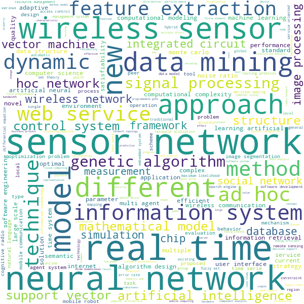

# Dynamic Graph Neural Network for Link Prediction

This repository uses the library proposed in the paper [Towards Better Dynamic Graph Learning: New Architecture and Unified Library](https://arxiv.org/abs/2303.13047) to train a Dynamic GNN for link prediction on a citations networks to predict collaborations between authors. 

## Table of Contents

- [Dataset](#dataset)
- [Installation](#installation)
- [Usage](#usage)
- [Project Description](#project-description)

## Dataset

The AMiner Citation Network Dataset is a comprehensive collection of academic papers and their citation relationships. This dataset is widely used for various research tasks in the fields of data mining, network analysis, and scientometrics.

- **Version**: 14
- **Source**: [AMiner](https://www.aminer.cn/citation)
- **Contents**: Academic papers with metadata (title, authors, year, venue, etc.) and citation relationships
- **Size**: Large-scale dataset ($\approx 15 GB$.)

### Visualizations

The following visualizations provide insights into the dataset:

<div style="display: flex; justify-content: center; align-items: flex-start; gap: 20px;">

  <div style="text-align: center;">
    <strong>- Number of Papers per Year</strong><br>
    
  </div>

  <div style="text-align: center;">
    <strong>- Word Cloud Animation (2010-2023)</strong><br>
    
  </div>

</div>

## Installation

### Clone the Repository

To get started, clone the repository:

```bash
git clone https://github.com/Prot10/DyGNN.git
```

Navigate to the repository directory:

```bash
cd DyGNN
```

### Set Up the Environment

Create a conda environment with Python 3.11 and install the required packages:

```bash
conda create -n dygnn python=3.11
conda activate dygnn
pip install -e .
```

### Downloading the Dataset

You can download and unzip the dataset inside the data folder using one of the following methods:

#### Raw Dataset

To download the raw dataset:

```bash
mkdir -p dygnn/dataset/raw_data && wget -c https://originalfileserver.aminer.cn/misc/dblp_v14.tar.gz -O - | tar -xz -C dygnn/dataset/raw_data
```

#### Preprocessed Data

Alternatively, you can download the preprocessed data:

```bash
mkdir -p dygnn/DyGLib/processed_data && \
gdown --fuzzy https://drive.google.com/uc?id=17BFRcP_wOwRwsCfxbUbIyZobX2ji2K3b -O dygnn/DyGLib/processed_data/citations.tar.gz && \
tar -xvf dygnn/DyGLib/processed_data/citations.tar.gz -C dygnn/DyGLib/processed_data
```

## Usage

This project has three main steps: data preprocessing, model training, and evaluation. You can run all steps or skip some if you have preprocessed data or pre-trained weights.

### 1. Data Preprocessing
- **Script**: `run_data_preprocessing.sh`
- **Description**: Processes raw data and generates features.
  
```bash
bash run_data_preprocessing.sh
```

### 2. Model Training
- **Script**: `run_train_link_prediction.sh`
- **Description**: Trains the model on preprocessed data.

```bash
bash run_train_citations.sh
```

### 3. Model Evaluation
- **Script**: `run_evaluate_link_prediction.sh`
- **Description**: Evaluates the model's performance.

```bash
bash run_evaluate_citations.sh
```

### Customizing Parameters

Each script can be customized by passing arguments. Use the `--help` flag for more information on available options:

```bash 
bash run_data_preprocessing.sh --help
bash run_train_link_prediction.sh --help
bash run_evaluate_link_prediction.sh --help
```


## Project Description

### Overview

Developed a series of Python modules to process a dataset of academic citations and create various structured representations suitable for analysis. The project includes functions for data extraction, transformation, and storage, focusing on creating a graph-like structure of citations between authors based on their published works.

### Key Tasks Performed

#### 1. Data Extraction:

Implemented a function to extract specific fields from a JSON dataset containing academic papers. This included fields such as id, title, keywords, year, n_citation, abstract, authors, doc_type, and references.
Extracted author details (IDs, names, organizations) from nested structures in the dataset.

#### 2. Data Filtering and Organization:

Filtered the extracted data based on publication year and organized it into a pandas DataFrame for easier manipulation.
Created subsets of data for each publication year, facilitating year-wise analysis.

#### 3. Edge Index Creation:

Constructed an edge index that represents relationships between authors based on their co-authored papers, utilizing author IDs and relevant textual information (titles, keywords, abstracts).
Mapped document types and citation counts to numerical representations for further analysis.

#### 4. Normalization and Mapping:

Developed a normalization procedure for citation counts using z-score normalization to prepare the data for machine learning.
Created mappings from author names and years to unique integers for efficient processing and storage.

#### 5. Dimensionality Reduction:

Employed Truncated Singular Value Decomposition (SVD) to reduce the dimensionality of text embeddings generated from the citation texts using a pre-trained Sentence-BERT model.
Generated text embeddings to capture the semantic meaning of citation texts for use in machine learning models.

#### 6. Data Saving:

Implemented functions to save processed DataFrames and NumPy arrays into CSV and .npy file formats in a structured directory, ensuring that processed data is easily accessible for future use.

#### 7. Node Features Creation:

Created a new DataFrame with a structured representation of the edge index, facilitating downstream tasks such as training machine learning models or graph analyses.
Constructed a node feature matrix for authors, where each author is represented by a vector that captures their properties.

#### 8. Command-Line Interface:

Developed a command-line interface (CLI) for executing the processing scripts, allowing for easy specification of parameters like the number of components for dimensionality reduction and the number of columns for the node features matrix.

#### 9. Dynamic GNN Training

Developed and trained various Temporal Graph Neural Networks (GNNs) using the constructed dataset. The training process involved optimizing hyperparameters to enhance model performance in link prediction tasks. Different architectures were explored to determine the most effective approach for predicting collaborations among authors based on citation relationships.

#### 10. Evaluation of Link Predictions

Conducted comprehensive evaluations of the link prediction models, focusing on performance metrics such as accuracy, precision, recall, and F1 score. Comparative analyses were performed to assess the strengths and weaknesses of each model, providing insights into their effectiveness in predicting potential collaborations within the citation network.
